<h2>👾 A Little Bit About Me and My Interests</h2>

```yaml
{
  "profile": {
    "name": "Miguel",
    "location": "Belo Horizonte, MG",
  },
  "education": [
    "Self-Taught fluent english",
    "Self-Taught Python & Dart",
    "Studying Bachelor of Computer Science (5/8)"
],
  "skills": [
    "C#",
    "Python",
    "Dart",
  ],
  "tools": [
    "Git",
    "Cloudflare",
    "Firebase",
    "AWS",
    "VS Code"
  ],
}
```

<br>

<br>

<h2> 🚀 &nbsp;Some Tools I Have Used and Learned</h2>
<p align="left">


</p>
<br>
<div>
<a href="https://www.youtube.com/watch?v=LYwaBpL6njk">

</a>
<a href="https://www.youtube.com/watch?v=LYwaBpL6njk">
</a>
<a href="https://www.youtube.com/watch?v=LYwaBpL6njk">
</a>
</div>
